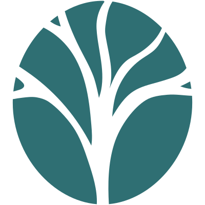

# My Brain Sage Website: Build Notes

Working notes for the v1.0 website. Built 23 May 2026 in Cowork. The full
plan and rationale live in `04_Strategy/MBS_Website_Decisions_17May2026.docx`
(read its 23 May reconciliation note first: the newsletter is parked for v1.0).

## What is in this folder

A complete static site, four content pages plus an essays section, ready to
host on GitHub Pages.

- `index.html` — Home. Philosophy-led, the muscle and neuromodulator opener.
- `about.html` — About. The case for brain literacy, the founder voice.
- `essays.html` — Essays index. A growing list of long-form pieces.
- `essay-founder.html` — The Founder Essay, the first essay.
- `privacy.html` — Privacy policy. Required for App Store and Google Play.
- `support.html` — Support. Required for App Store and Google Play. Contact email.
- `style.css` — Shared stylesheet. Inherits the app design system.
- `assets/` — Ruby's graphic assets go here. See `assets/README.txt`.

Nav across every page: Home, About, Essays, Privacy, Support.

House style for all copy: no em-dashes, no en-dashes, no Oxford commas, no
curly double-quotes. Colons, commas and full stops instead.

## Adding a new essay later

The essays section is built to grow without restructuring.

1. Copy `essay-founder.html` to `essay-[name].html`.
2. Replace its content with the new essay. Keep the header, footer and styling.
3. Add one new card to the list in `essays.html`, newest at the top.

That is the whole process. No build step, no index to regenerate.

## Importing Ruby's graphics when they arrive

The site runs fully without graphics; the text wordmark in the header is the
correct fallback. When Ruby delivers, place the files in `assets/` with the
names listed in `assets/README.txt`, then make these edits.

Logo (`assets/logo.svg`):
  In each page's header, the line `<a href="index.html" class="site-title">My
  Brain Sage</a>` can be changed to wrap a logo image:
  ``
  Adjust `height` to taste. Apply the same change to all six pages so the
  header is consistent.

Favicon (`assets/favicon.png`):
  Add one line inside each page's `<head>`:
  `<link rel="icon" type="image/png" href="assets/favicon.png">`

Social-share image (`assets/og-image.png`, optional):
  Add to each page's `<head>`:
  `<meta property="og:image" content="https://mybrainsage.com/assets/og-image.png">`
  `<meta property="og:title" content="My Brain Sage">`
  `<meta property="og:description" content="Understand your brain. Build wisdom that lasts.">`

A coordinated iconography review across the site can happen at the same time,
matching whatever icon style Ruby establishes for the app.

## Deploying to GitHub Pages

Per the website plan, the site lives in its own repository, separate from the
app code.

1. Register the domain. Working choice `mybrainsage.com` via Cloudflare
   Registrar. Fallback `mybrainsage.app`. Avoid `.com.au`.
2. Create a new GitHub repository (suggested name `mybrainsage-website`).
3. Copy the contents of this `06_Website` folder into the repository root.
4. In the repository settings, enable GitHub Pages, serving from the main
   branch root. The site publishes within minutes.
5. In Pages settings, add the custom domain and follow the DNS instructions
   at the registrar. SSL is automatic.
6. Updates happen by editing files and pushing to the main branch.

## Still to do before the site is launch-ready

- Register the domain.
- Real download URLs. `index.html` has placeholder `href="#"` on the two
  download buttons. Replace with the App Store and Google Play URLs once the
  apps have store listings.
- Confirm the support email. Currently `grantreeves01@gmail.com` in
  `support.html` and referenced by `privacy.html`. May change to a domain
  address such as `hello@mybrainsage.com` once the domain is live.
- Import Ruby's graphics per the section above.

## App link to the website (Claude Code prompt)

The app's Settings screen should link out to the website. This is a code
change in the app, run in Claude Code from the app repo. Prompt to paste:

---

Re-read C:\Users\grant\Projects\brain-sage\CLAUDE.md before beginning.

Add a link to the My Brain Sage website from the app's Settings screen.

Placement and copy: Add a single row to the Settings screen, in the About /
side-doors area, near the existing "About this app" entry. Label: "Visit
mybrainsage.com". Subtitle (smaller, muted): "The website: essays, the privacy
commitment, and more." Right chevron. Tapping it opens the website in the
device's external browser (use React Native's Linking.openURL).

URL: use https://mybrainsage.com as a constant. The domain is not yet
registered, so define it as a single named constant (e.g. WEBSITE_URL in a
config/constants file) so it can be confirmed or changed in one place later.

Voice: follow the language guide. Quiet entry, no popup, no urgency,
consistent with the other side-door rows.

Do not change: any other Settings rows, the app's scoring, or unrelated
screens. This prompt adds one Settings row and one URL constant only.

Acceptance: the row appears in Settings, tapping it opens the external browser
to the website URL, and the URL lives in a single named constant.

---
